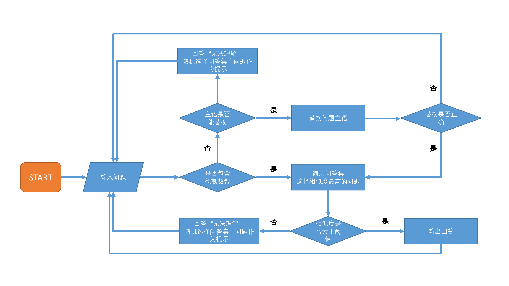

<h1 align="center">
  <br>
  <a href="https://github.com/TheSuguser/chatbotz"></a>
  <br>
  ChatbotZ
  <br>
</h1>

<h4 align="center">本项目是一个封闭域内的聊天问答机器人。</h4>

## How to use
### 依赖
* python = 3.6
* numpy = 1.16.2
* jieba = 0.39
* pandas = 0.24.2
* scipy = 1.2.1

也可通过``requirements.txt``用``pip``直接安装依赖。建议在虚拟环境中使用。
```
# Clone this repository
$ git clone https://github.com/TheSuguser/chatbotz.git

# Go into the repository
$ cd chatbotz

# Install the dependencies
$ pip install -r requirements.txt
```

### 配置文件
ChatbotZ的相关配置在``param.cfg``中。因为词向量文件太大，因此没有上传在github上，需要自行下载，并在``word_vec_path``后添加词向量文件的路径。推荐使用基于百度百科训练的词向量。[下载地址](https://pan.baidu.com/s/1Gndr0fReIq_oJ3R34CxlPg)

### 运行
```
python main.py
```
注：加载词向量需要较长时间。运行时效果如下

<h1 align="center">
 
</h1>

## How it works
### ChatbotZ基本运行逻辑
ChatbotZ的基本运行逻辑如下图所示


### 相似度计算
因为是封闭域的聊天机器人，模型的输入与输出是可枚举的，因此采用了句向量的**余弦相似性**来衡量问题之间的相似度。

在枚举问题和答案时发现，在该封闭域中句子的语序并不是非常重要，因此句向量的计算是通过计算组成句子的词所对应的词向量的平均值来完成的。

### 预处理
在研究分词与词向量时,我发现有很多该封闭域下的词语是OOV，并没有对应的词向量，对于OOV通常的做法是
1. 忽略
2. 通过组成OOV的字的字向量的平均值来构建词向量

因为词向量具有空间性质，因此在chatbotz中，对于几个关键oov的词向量构建，我使用了它实际含义的近义词的平均值来构建。比如： 

* 大数据 = (大 + 数据) / 2
* RPA = (机器人 + 自动化) / 2
* 区块链 = (区块 + 链) / 2

## Pros and cons
### 优点
* 计算较快速。
* 具有一定可拓展性。
* 对使用者有一定的引导功能。

## 缺点
* 模型表现非常依赖于问答集的构建
* 不支持多轮对话，仅支持程序引导下的伪多轮对话。

## Future work
* 语料的构建可以更加丰富。因为是一个人完成问答集的创建，所以思路难免有些片面。
* 可以使用更加精细化的模型，比如给予“填槽”思维的模型。在后期原本打算迭代一次使用“填槽”作为辅助。但是因为时间有限，所以最后还是没有使用。
* 加入闲聊模块。因为是封闭语境的聊天机器人，所以问答集的构建都是基于该语境，难免会显得有些生硬，因此加入闲聊模块能更加丰富聊天机器人。
* 问答集的存储形式可以进一步改进。现在为了方便期间存储在pandas的Dataframe中，并不是十分高效，后期可以替换为更加高效的存储形式。